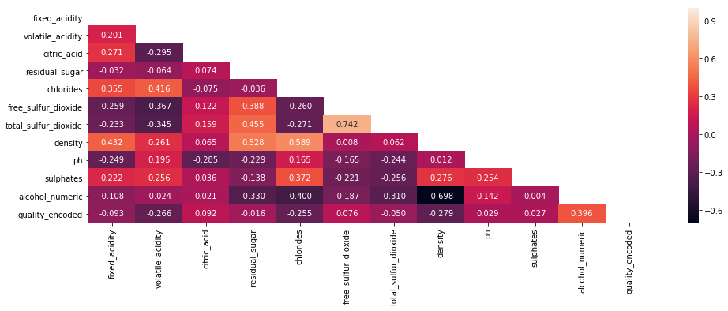
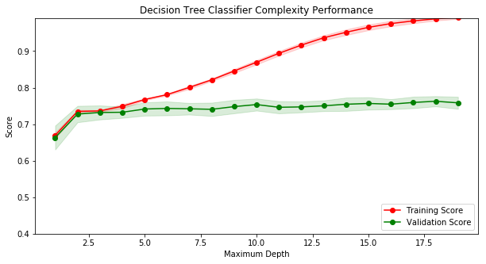

```python
%%html 
<style>
.rendered_html code {
    padding: 2px 4px;
    font-size: 90%;
    color: #c7254e;
    background-color: #f9f2f4;
    border-radius: 4px;
}

.output_png {
    display: table-cell;
    text-align: center;
    vertical-align: middle;
}

.rendered_html td {
    text-align: left;
}
span.text-strike {
    text-decoration: line-through;
}
span.text-red {
    color: red;
}
</style>
```


<style>
.rendered_html code {
    padding: 2px 4px;
    font-size: 90%;
    color: #c7254e;
    background-color: #f9f2f4;
    border-radius: 4px;
}

.output_png {
    display: table-cell;
    text-align: center;
    vertical-align: middle;
}

.rendered_html td {
    text-align: left;
}
span.text-strike {
    text-decoration: line-through;
}
span.text-red {
    color: red;
}
</style>


# Previsão da qualidade de vinhos

Este notebook visa explorar o dataset de vinhos para compreender como cada característica dos mesmos impactam em sua qualidade. Além disso, a qualidade do vinho será prevista a partir de tais características. Para isso, usaremos técnicas de aprendizado supervisionado. Este documento é dividido da seguinte forma:

* Análise exploratória dos dados
* Análise da relação entre as variáveis
* Pré processamento dos dados
* Implementação e análise do modelo
* Conclusões
* Referências 

As linhas de código abaixo apenas carregam o dataset em memória e definem algumas funções úteis para esse projeto. Faremos um pequeno ajuste no nome das colunas para que sigam o padrão _snake_case_ e _lower case_ (padrão "pythônico").


```python
import pandas as pd
import numpy as np
import sys
import math
import matplotlib.pyplot as plt
import re
import seaborn as sns
import helper

from scipy.stats import chi2_contingency
from __future__ import division
from tmcm_feature_engineering import TMCMFeatureEng
from sklearn.model_selection import train_test_split, ShuffleSplit, GridSearchCV
from sklearn.feature_selection import SelectKBest, f_classif
from sklearn import tree
from sklearn.metrics import accuracy_score, confusion_matrix, precision_score, recall_score
from sklearn.svm import SVC


def slugify(c):
    # make strnig lower case
    c = c.lower()
    # remove unused white spaces
    c = c.strip()
    # replace multiple spaces with one
    c = re.sub('\s+', ' ', c)
    # replace spaces with underscore
    c = c.replace(" ", "_")
    return(c)

df = pd.read_csv("data/winequality.csv", sep=";")

rename_dict = {}
for c in df.columns:
    old_c = c
    new_c = slugify(c)
    rename_dict[old_c] = new_c
    
df = df.rename(columns=rename_dict)
```


```python
df.dtypes
```


    type                     object
    fixed_acidity           float64
    volatile_acidity        float64
    citric_acid             float64
    residual_sugar          float64
    chlorides               float64
    free_sulfur_dioxide     float64
    total_sulfur_dioxide    float64
    density                 float64
    ph                      float64
    sulphates               float64
    alcohol                  object
    quality                   int64
    dtype: object


## Análise exploratória dos dados

Nesta seção exploraremos as características básicas do dataset, não apenas suas dimensões mas também as suas variáveis. O dataset contém 6497 linhas e 13 colunas nas quais cada linha representa um vinho diferente com suas características e apresenta as seguintes colunas:

* `type`: tipo do vinho (categórica)
* `fixed acidity`: acidez fixa (numérica)
* `volatile_acitidy`: acidez volátil (numérica)
* `citric_acid`: quantidade de ácido cítrico (numérica)
* `residual_sugar`: quantidade de açúcar residual (numérica)
* `chlorides`: quantidade de cloretos (numérica)
* `free_sulfur_dioxide`: quantidade de dióxido sulfúrico livre (numérica)
* `total_sulfur_dioxide`: quantidade total de dióxido sulfúrico (numérica)
* `density`: densidade do vinho (numérica)
* `ph`: potencial de hidrogênio do vinho, ou seja, o quanto ele é ácido ou básico (numérica)
* `sulphates`: quantiadde de sulfato no vinho (numérica)
* `alcohol`: quantidade de álcool no vinho (numérica)
* `quality`: qualidade do vinho (categórica)

O código abaixo apresenta uma amostra dos dados sobre vinhos. É perceptível também a partir do código abaixo que todas as variáveis são 100% preenchidas com algum valor. Porém, é preciso de atentar a variável `alcohol` foi identificada pelo Pandas como `object` mas aparentemente ela deveria ser do tipo `float64` (numérica); investigaremos nas próximas seções por que isso deve estar acontencendo. 


```python
df.head()
```


<div>
<style scoped>
    .dataframe tbody tr th:only-of-type {
        vertical-align: middle;
    }

    .dataframe tbody tr th {
        vertical-align: top;
    }

    .dataframe thead th {
        text-align: right;
    }
</style>
<table border="1" class="dataframe">
  <thead>
    <tr style="text-align: right;">
      <th></th>
      <th>type</th>
      <th>fixed_acidity</th>
      <th>volatile_acidity</th>
      <th>citric_acid</th>
      <th>residual_sugar</th>
      <th>chlorides</th>
      <th>free_sulfur_dioxide</th>
      <th>total_sulfur_dioxide</th>
      <th>density</th>
      <th>ph</th>
      <th>sulphates</th>
      <th>alcohol</th>
      <th>quality</th>
    </tr>
  </thead>
  <tbody>
    <tr>
      <th>0</th>
      <td>White</td>
      <td>7.0</td>
      <td>0.27</td>
      <td>0.36</td>
      <td>20.7</td>
      <td>0.045</td>
      <td>45.0</td>
      <td>170.0</td>
      <td>1.0010</td>
      <td>3.00</td>
      <td>0.45</td>
      <td>8.8</td>
      <td>6</td>
    </tr>
    <tr>
      <th>1</th>
      <td>White</td>
      <td>6.3</td>
      <td>0.30</td>
      <td>0.34</td>
      <td>1.6</td>
      <td>0.049</td>
      <td>14.0</td>
      <td>132.0</td>
      <td>0.9940</td>
      <td>3.30</td>
      <td>0.49</td>
      <td>9.5</td>
      <td>6</td>
    </tr>
    <tr>
      <th>2</th>
      <td>White</td>
      <td>8.1</td>
      <td>0.28</td>
      <td>0.40</td>
      <td>6.9</td>
      <td>0.050</td>
      <td>30.0</td>
      <td>97.0</td>
      <td>0.9951</td>
      <td>3.26</td>
      <td>0.44</td>
      <td>10.1</td>
      <td>6</td>
    </tr>
    <tr>
      <th>3</th>
      <td>White</td>
      <td>7.2</td>
      <td>0.23</td>
      <td>0.32</td>
      <td>8.5</td>
      <td>0.058</td>
      <td>47.0</td>
      <td>186.0</td>
      <td>0.9956</td>
      <td>3.19</td>
      <td>0.40</td>
      <td>9.9</td>
      <td>6</td>
    </tr>
    <tr>
      <th>4</th>
      <td>White</td>
      <td>7.2</td>
      <td>0.23</td>
      <td>0.32</td>
      <td>8.5</td>
      <td>0.058</td>
      <td>47.0</td>
      <td>186.0</td>
      <td>0.9956</td>
      <td>3.19</td>
      <td>0.40</td>
      <td>9.9</td>
      <td>6</td>
    </tr>
  </tbody>
</table>
</div>


```python
def calculate_density(df):
    sparsity_dict = {}
    for col in df.columns:
        sparsity_dict[col] = df[col].count()/df.shape[0]
    return(sparsity_dict)

density_dict = calculate_density(df)
sorted_density_list = sorted(density_dict.items(), key=lambda x: x[1])

print("\n")
for l in sorted_density_list:
    print("{:25} => Density of {:4.2f}%".format(l[0], l[1]*100))
```

    
    
    alcohol                   => Density of 100.00%
    chlorides                 => Density of 100.00%
    density                   => Density of 100.00%
    quality                   => Density of 100.00%
    sulphates                 => Density of 100.00%
    fixed_acidity             => Density of 100.00%
    free_sulfur_dioxide       => Density of 100.00%
    residual_sugar            => Density of 100.00%
    volatile_acidity          => Density of 100.00%
    ph                        => Density of 100.00%
    total_sulfur_dioxide      => Density of 100.00%
    type                      => Density of 100.00%
    citric_acid               => Density of 100.00%


### Explorando variável target: quality

A descrição do desafio informa que a variável `quality` pode receber valores inteiros que variam entre 0 e 10. Porém, como pode ser visto no gráfico abaixo, **não existem exemplos** no dataset de vinhos com qualidade entre 0 e 2 e nem com qualidade 10. Além disso, a qualidade segue uma distribuição normal, havendo uma concentração de vinhos com qualidade 5, 6 e 6 (vinhos de certa forma medianos) e uma quantidade significativamente menor de vinhos de baixa qualidade e alta qualidade. 

Também é possível notar que o número de exemplos de vinhos com qualidade 3, 4, 8 e 9 é tão pequeno que pode ser muito difícil treinar qualquer algoritmo para prever essas classes. Para lidar com isso, simplificaremos o problema desse estudo para contermos apenas duas classes de vinho: _Bad_, composta pelas classes de 3 a 5 e _Good_, composta pelas classes 6 a 9. O código abaixo realiza essa atividade e depois mostra a nova divisão entre classes. É possível notar que existe uma relação de 1:2 entre as mesmas.


```python
grouped_df = df.groupby('quality').agg({'type':'count'}).reset_index()

# plt.figure(figsize=(15,5))
ax = grouped_df.plot.bar(x='quality', figsize=(15,5), alpha=0.75, rot=0, ylim=(0,3100))
x_offset = -0.1
y_offset = 100
for p in ax.patches:
    b = p.get_bbox()
    val = "{}".format(int(b.y1 + b.y0))        
    ax.annotate(val, ((b.x0 + b.x1)/2 + x_offset, b.y1 + y_offset))

plt.show()
```


```python
df['quality_updated'] = df['quality'].apply(lambda x: "Bad" if x < 6 else "Good")
df['quality_encoded'] = df['quality_updated'].apply(lambda x: 0 if x == "Bad" else 1)
```


```python
grouped_df = df.groupby('quality_encoded').agg({'type':'count'}).reset_index()

# plt.figure(figsize=(15,5))
ax = grouped_df.plot.bar(x='quality_encoded', figsize=(15,5), alpha=0.75, rot=0, ylim=(0,4500))
x_offset = -0.1
y_offset = 100
for p in ax.patches:
    b = p.get_bbox()
    val = "{}".format(int(b.y1 + b.y0))        
    ax.annotate(val, ((b.x0 + b.x1)/2 + x_offset, b.y1 + y_offset))

plt.show()
```


### Explorando variáveis categóricas

O código abaixo mostra que a variável `type` contém apenas dois valores possíveis: _White_ e _Red_. É possível notar também que 75% dos exemplos são de vinhos branco e os demais de vinho tinto. 


```python
df_grouped = df.groupby('type').agg({'quality': 'count'}).reset_index().rename(columns={"quality": 'type_count'})
df_grouped['type_perc'] = (df_grouped['type_count']*100/df_grouped['type_count'].sum())
df_grouped.head()
```


<div>
<style scoped>
    .dataframe tbody tr th:only-of-type {
        vertical-align: middle;
    }

    .dataframe tbody tr th {
        vertical-align: top;
    }

    .dataframe thead th {
        text-align: right;
    }
</style>
<table border="1" class="dataframe">
  <thead>
    <tr style="text-align: right;">
      <th></th>
      <th>type</th>
      <th>type_count</th>
      <th>type_perc</th>
    </tr>
  </thead>
  <tbody>
    <tr>
      <th>0</th>
      <td>Red</td>
      <td>1599</td>
      <td>24.611359</td>
    </tr>
    <tr>
      <th>1</th>
      <td>White</td>
      <td>4898</td>
      <td>75.388641</td>
    </tr>
  </tbody>
</table>
</div>


### Explorando variáveis numéricas

O código abaixo apresenta um resumo das variáveis numéricas do dataset. É importante notar que elas não estão na mesma escala, como é o caso das variáveis `volatile_acidity`, que possui valores entre 0.08 e 1.5, e `total_sulfur_dioxide`, que possui valores entre 6.0 e 44.0. Outro ponto interessante a ser notado é que algumas variáveis parecem ter _outliers_, tais como `total_sulfur_dioxide` e `free_sulfur_dioxide`, cujos valores máximos são muito superiores ao percentil de 99% (foi feito o histograma dessas duas variávels a título de exemplo). 

Uma consequência interessante dessas observações é que teremos de fazer transformações nos dados para que estejam na mesma escala. Essa atividade será feita mais adiante na etapa de pré processamento dos dados. 


```python
numeric_cols = ["fixed_acidity", "volatile_acidity", "citric_acid", "residual_sugar", "chlorides", 
                "free_sulfur_dioxide", "total_sulfur_dioxide", "density", "ph", "sulphates"]

df[numeric_cols].describe(percentiles=[.25, .5, .75, .99])
```


<div>
<style scoped>
    .dataframe tbody tr th:only-of-type {
        vertical-align: middle;
    }

    .dataframe tbody tr th {
        vertical-align: top;
    }

    .dataframe thead th {
        text-align: right;
    }
</style>
<table border="1" class="dataframe">
  <thead>
    <tr style="text-align: right;">
      <th></th>
      <th>fixed_acidity</th>
      <th>volatile_acidity</th>
      <th>citric_acid</th>
      <th>residual_sugar</th>
      <th>chlorides</th>
      <th>free_sulfur_dioxide</th>
      <th>total_sulfur_dioxide</th>
      <th>density</th>
      <th>ph</th>
      <th>sulphates</th>
    </tr>
  </thead>
  <tbody>
    <tr>
      <th>count</th>
      <td>6497.000000</td>
      <td>6497.000000</td>
      <td>6497.000000</td>
      <td>6497.000000</td>
      <td>6497.000000</td>
      <td>6497.000000</td>
      <td>6497.000000</td>
      <td>6497.000000</td>
      <td>6497.000000</td>
      <td>6497.000000</td>
    </tr>
    <tr>
      <th>mean</th>
      <td>7.215307</td>
      <td>0.339666</td>
      <td>0.318633</td>
      <td>5.443235</td>
      <td>0.056034</td>
      <td>30.525319</td>
      <td>115.744574</td>
      <td>1.710882</td>
      <td>3.218501</td>
      <td>0.531268</td>
    </tr>
    <tr>
      <th>std</th>
      <td>1.296434</td>
      <td>0.164636</td>
      <td>0.145318</td>
      <td>4.757804</td>
      <td>0.035034</td>
      <td>17.749400</td>
      <td>56.521855</td>
      <td>7.636088</td>
      <td>0.160787</td>
      <td>0.148806</td>
    </tr>
    <tr>
      <th>min</th>
      <td>3.800000</td>
      <td>0.080000</td>
      <td>0.000000</td>
      <td>0.600000</td>
      <td>0.009000</td>
      <td>1.000000</td>
      <td>6.000000</td>
      <td>0.987110</td>
      <td>2.720000</td>
      <td>0.220000</td>
    </tr>
    <tr>
      <th>25%</th>
      <td>6.400000</td>
      <td>0.230000</td>
      <td>0.250000</td>
      <td>1.800000</td>
      <td>0.038000</td>
      <td>17.000000</td>
      <td>77.000000</td>
      <td>0.992340</td>
      <td>3.110000</td>
      <td>0.430000</td>
    </tr>
    <tr>
      <th>50%</th>
      <td>7.000000</td>
      <td>0.290000</td>
      <td>0.310000</td>
      <td>3.000000</td>
      <td>0.047000</td>
      <td>29.000000</td>
      <td>118.000000</td>
      <td>0.994890</td>
      <td>3.210000</td>
      <td>0.510000</td>
    </tr>
    <tr>
      <th>75%</th>
      <td>7.700000</td>
      <td>0.400000</td>
      <td>0.390000</td>
      <td>8.100000</td>
      <td>0.065000</td>
      <td>41.000000</td>
      <td>156.000000</td>
      <td>0.996990</td>
      <td>3.320000</td>
      <td>0.600000</td>
    </tr>
    <tr>
      <th>99%</th>
      <td>12.000000</td>
      <td>0.880000</td>
      <td>0.740000</td>
      <td>18.200000</td>
      <td>0.186160</td>
      <td>77.000000</td>
      <td>238.000000</td>
      <td>10.008000</td>
      <td>3.640000</td>
      <td>0.990000</td>
    </tr>
    <tr>
      <th>max</th>
      <td>15.900000</td>
      <td>1.580000</td>
      <td>1.660000</td>
      <td>65.800000</td>
      <td>0.611000</td>
      <td>289.000000</td>
      <td>440.000000</td>
      <td>103.898000</td>
      <td>4.010000</td>
      <td>2.000000</td>
    </tr>
  </tbody>
</table>
</div>


```python
fig, axes = plt.subplots(nrows=1, ncols=2, figsize=(15,5))

df['free_sulfur_dioxide'].hist(alpha=.5, ax=axes[0])
axes[0].set_title('Histograma - Dioxido Sulfurico Livre')
df['total_sulfur_dioxide'].hist(alpha=.5, ax=axes[1])
axes[1].set_title('Histograma - Total de Dioxido Sulfurico')
plt.show()
```


### O caso da variável alcohol

Como citado anteriormente, a variável `alcohol` foi identificada pelo Pandas como `object` porém ela deveria ser `float64` (numérica). O código abaixo mostra que existem alguns valores anômalos no dataset, provavelmente advindos de medições inadequadas. Também é possível notar que os exemplos com dados equivocados correspondem a apenas 0,6% do todo. Para lidar com essa situação, iremos remover as linhas em que `alcohol_numeric == NaN`. 


```python
df['alcohol_numeric'] = pd.to_numeric(df['alcohol'], errors='coerce')
```


```python
df.loc[df['alcohol_numeric'].isnull(), ['alcohol', 'alcohol_numeric']].head(10)
```


<div>
<style scoped>
    .dataframe tbody tr th:only-of-type {
        vertical-align: middle;
    }

    .dataframe tbody tr th {
        vertical-align: top;
    }

    .dataframe thead th {
        text-align: right;
    }
</style>
<table border="1" class="dataframe">
  <thead>
    <tr style="text-align: right;">
      <th></th>
      <th>alcohol</th>
      <th>alcohol_numeric</th>
    </tr>
  </thead>
  <tbody>
    <tr>
      <th>4315</th>
      <td>128.933.333.333.333</td>
      <td>NaN</td>
    </tr>
    <tr>
      <th>4319</th>
      <td>128.933.333.333.333</td>
      <td>NaN</td>
    </tr>
    <tr>
      <th>4323</th>
      <td>114.666.666.666.667</td>
      <td>NaN</td>
    </tr>
    <tr>
      <th>4341</th>
      <td>100.333.333.333.333</td>
      <td>NaN</td>
    </tr>
    <tr>
      <th>4353</th>
      <td>114.333.333.333.333</td>
      <td>NaN</td>
    </tr>
    <tr>
      <th>4356</th>
      <td>105.333.333.333.333</td>
      <td>NaN</td>
    </tr>
    <tr>
      <th>4358</th>
      <td>953.333.333.333.333</td>
      <td>NaN</td>
    </tr>
    <tr>
      <th>4364</th>
      <td>109.333.333.333.333</td>
      <td>NaN</td>
    </tr>
    <tr>
      <th>4369</th>
      <td>109.333.333.333.333</td>
      <td>NaN</td>
    </tr>
    <tr>
      <th>4372</th>
      <td>113.666.666.666.667</td>
      <td>NaN</td>
    </tr>
  </tbody>
</table>
</div>


```python
df.loc[df['alcohol_numeric'].notnull(), ['alcohol', 'alcohol_numeric']].head()
```


<div>
<style scoped>
    .dataframe tbody tr th:only-of-type {
        vertical-align: middle;
    }

    .dataframe tbody tr th {
        vertical-align: top;
    }

    .dataframe thead th {
        text-align: right;
    }
</style>
<table border="1" class="dataframe">
  <thead>
    <tr style="text-align: right;">
      <th></th>
      <th>alcohol</th>
      <th>alcohol_numeric</th>
    </tr>
  </thead>
  <tbody>
    <tr>
      <th>0</th>
      <td>8.8</td>
      <td>8.8</td>
    </tr>
    <tr>
      <th>1</th>
      <td>9.5</td>
      <td>9.5</td>
    </tr>
    <tr>
      <th>2</th>
      <td>10.1</td>
      <td>10.1</td>
    </tr>
    <tr>
      <th>3</th>
      <td>9.9</td>
      <td>9.9</td>
    </tr>
    <tr>
      <th>4</th>
      <td>9.9</td>
      <td>9.9</td>
    </tr>
  </tbody>
</table>
</div>


```python
errors_count = (df[df['alcohol_numeric'].isnull()].shape[0]*100)/df.shape[0]

print("Apenas {:2f}% das linhas contem dados inadequados de teor alcoolico".format(errors_count))
```

    Apenas 0.615669% das linhas contem dados inadequados de teor alcoolico


```python
df = df[df['alcohol_numeric'].notnull()]
```

## Relação entre as variáveis

Nesta seção vamos identificar como as variáveis preditoras se relacionam com a variável de destino (`quality`). Usaremos algns testes estatísticos para isso. Como `quality` é categórica, precisamos utilizar técnicas adequadas para este cenário: aplicaremos o teste Chi quadrado para variáveis categóricas e correlação de Spearman para as variáveis numéricas.

### Correlação para variáveis categóricas

O teste de independência do chi quadrado avalia de suas variáveis categóricas são relacionadas em uma população. Sua hipótese nula é de que as duas variáveis são independentes. Vamos aplicar o teste para as variáveis `type` e `quality_encoded` e usar o nível de significância de 0.05. É possível observar uma explicação básica deste neste em [[1]](#references)

Como pode ser visto no código abaixo, o p-value do teste é $3,99 \times 10^{-21}$, o que significa que devemos rejeitar a hipótese nula de que a variável `type_encoded` é independente da variável `quality_encoded`. Isso é um indicativo de que devemos manter a variável `type_encoded` no modelo.


```python
def chisq_of_df_cols(df, c1, c2):
    groupsizes = df.groupby([c1, c2]).size()
    ctsum = groupsizes.unstack(c1)
    # fillna(0) is necessary to remove any NAs which will cause exceptions
    return(chi2_contingency(ctsum.fillna(0)))
```


```python
df['type_encoded'] = df['type'].apply(lambda x: 1 if x == "Red" else 2)
```


```python
chi2, p_value, dof, expected =  chisq_of_df_cols(df, 'type_encoded', 'quality_encoded')

print("p-value is: {}".format(p_value))
```

    p-value is: 3.99662160315e-21


### Correlação para variáveis numéricas

Diferente da correlação de Pearson, adequada para comparação entre duas variáveis contínuas e com uma relação linear, a correlação de Spearman é adequada para variáveis ordinais e contínuas e avalia com que intensidade a relação entre duas variáveis pode ser descrita pelo uso de uma função monótona [[2]](#references). É possível observar uma explicação básica deste neste em [[3]](#references). 

O código abaixo cria uma matriz de correlação entre todas as variáveis numéricas e a variável output do dataset. A parte importante a ser observada é a última linha, que contém a correlação entre `quality_encoded` e todas as demais variáveis. Nela é possível notar alguns pontos:

* A variável álcool (`alcohol_numeric`) tem a maior correlação com `quality`. Densidade (`density`), cloretos (`chlorides`) e acidez volátil (`volatile_acidity`) também possuem correlação alta com `quality_encoded` porém são negativas, o que indica que são inversamente proporcionais
* A variável açúcar residual (`residual_sugar`) tem a menor correlação e ela também é negativa, o que indica que as variáveis são inversamente proporcionais. O açúcar residual também é a variável que tem correlação mais próxima de zero entre todas, o que é um indicativo de que podemos retirá-la do modelo que criaremos. 
* As variáveis que tem relação com dióxido sulfúrico, `free_sulfur_dioxide` e `total_sulfur_dioxide`, tem correlações baixas e de sinal oposto. Elas também são a segunda e terceira menores correlações, o que indica que também podemos retirá-las do modelo que criaremos. 


```python
numeric_cols = ["fixed_acidity", "volatile_acidity", "citric_acid", "residual_sugar", "chlorides", 
                "free_sulfur_dioxide", "total_sulfur_dioxide", "density", "ph", "sulphates", "alcohol_numeric"]
output_col = ["quality_encoded"]

plt.figure(figsize=(16,5))
corr = df[numeric_cols+output_col].corr(method="spearman")
# Generate a mask for the upper triangle
mask = np.zeros_like(corr, dtype=np.bool)
mask[np.triu_indices_from(mask)] = True
sns.heatmap(corr, mask=mask,
            xticklabels=corr.columns.values,
            yticklabels=corr.columns.values,
           annot=True, fmt= '.3f')
plt.show()
```





## Pré processamento dos dados

A partir das observações expostas na seção de análise exploratória dos dados nota-se que as variáveis numéricas estão em escalas diferentes, o que pode impactar no resultado dos modelos a ser criados. O código abaixo faz a normalização dos dados (mesmo procedimento do _Standard Scaler_ [[4]](#references) do sklearn). 

Outra atividade de pré-processamento que seria necessário é a transformação da variável `type` de string para número e, porém isso já foi realizado acima (criou-se a variável `type_encoded`). 


```python
suffix = "_scaled"
numeric_cols = ["fixed_acidity", "volatile_acidity", "citric_acid", "residual_sugar", "chlorides", 
                "free_sulfur_dioxide", "total_sulfur_dioxide", "density", "ph", "sulphates", "alcohol_numeric"]

for col in numeric_cols:
    df[col+suffix] = (df[col]-df[col].mean())/df[col].std()
```


```python
df[[c for c in df.columns if "_scaled" in c]].head()
```


<div>
<style scoped>
    .dataframe tbody tr th:only-of-type {
        vertical-align: middle;
    }

    .dataframe tbody tr th {
        vertical-align: top;
    }

    .dataframe thead th {
        text-align: right;
    }
</style>
<table border="1" class="dataframe">
  <thead>
    <tr style="text-align: right;">
      <th></th>
      <th>fixed_acidity_scaled</th>
      <th>volatile_acidity_scaled</th>
      <th>citric_acid_scaled</th>
      <th>residual_sugar_scaled</th>
      <th>chlorides_scaled</th>
      <th>free_sulfur_dioxide_scaled</th>
      <th>total_sulfur_dioxide_scaled</th>
      <th>density_scaled</th>
      <th>ph_scaled</th>
      <th>sulphates_scaled</th>
      <th>alcohol_numeric_scaled</th>
    </tr>
  </thead>
  <tbody>
    <tr>
      <th>0</th>
      <td>-0.169490</td>
      <td>-0.423124</td>
      <td>0.283184</td>
      <td>3.201730</td>
      <td>-0.315616</td>
      <td>0.816828</td>
      <td>0.959608</td>
      <td>-0.093261</td>
      <td>-1.359021</td>
      <td>-0.545236</td>
      <td>-1.415875</td>
    </tr>
    <tr>
      <th>1</th>
      <td>-0.710068</td>
      <td>-0.240963</td>
      <td>0.145733</td>
      <td>-0.807247</td>
      <td>-0.201689</td>
      <td>-0.928962</td>
      <td>0.288173</td>
      <td>-0.094174</td>
      <td>0.506124</td>
      <td>-0.276545</td>
      <td>-0.829100</td>
    </tr>
    <tr>
      <th>2</th>
      <td>0.679989</td>
      <td>-0.362403</td>
      <td>0.558088</td>
      <td>0.305192</td>
      <td>-0.173207</td>
      <td>-0.027909</td>
      <td>-0.330254</td>
      <td>-0.094031</td>
      <td>0.257438</td>
      <td>-0.612408</td>
      <td>-0.326149</td>
    </tr>
    <tr>
      <th>3</th>
      <td>-0.015040</td>
      <td>-0.666005</td>
      <td>0.008281</td>
      <td>0.641022</td>
      <td>0.054648</td>
      <td>0.929459</td>
      <td>1.242317</td>
      <td>-0.093966</td>
      <td>-0.177762</td>
      <td>-0.881099</td>
      <td>-0.493799</td>
    </tr>
    <tr>
      <th>4</th>
      <td>-0.015040</td>
      <td>-0.666005</td>
      <td>0.008281</td>
      <td>0.641022</td>
      <td>0.054648</td>
      <td>0.929459</td>
      <td>1.242317</td>
      <td>-0.093966</td>
      <td>-0.177762</td>
      <td>-0.881099</td>
      <td>-0.493799</td>
    </tr>
  </tbody>
</table>
</div>


### Ponto de atenção com a variável categórica

Ao utilizar implementações computacionais dos algoritmos de classificação, temos que transformar as variáveis categóricas que estão em formato de string para um valor numérico. Porém, é difícil encontrar um valor numérico que possa representá adequadamente essas variáveis no dataset. Por exemplo, quando criamos a coluna `type_encoded` acima, atribuímos o valor `1` para vinho tinto e `2` para vinho branco, mas isso não significa que esses números tenham algum tipo de "representação de valor", ou seja, não temos como dizer que `1` está próximo de "vinho tinho". 
Para lidar com essa questão, vamos listar duas opções sugeridas na literatura científica:

* **1-of-K Coding**: consiste em transformar todas as variáveis categóricas em dummy vars. Esse método, apesar de ter resultados satisfatórios, aumenta drasticamente o número de variáveis presentes no dataset o que pode prejudicar a performance do algoritmo e também gerar overfitting. É possível ver uma descrição da técnica em [[5]](#references) (o artigo fala de _clustering_, mas a técnica pode ser usada em situações de aprendizado supervisionado também).
* **Two-step Method for Clustering Mixed numeric and categorical data (TMCM)** [[6]](#references): o algoritmo foi desenvolvido para conseguir lidar com variáveis categóricas e numéricas simultaneamente na clusterização. Ele é dividido em duas etapas principais: a primeira é a manipulação de variáveis categóricas de acordo com a teoria de co-ocorrência, que analisa o relacionamento entre as variáveis categóricas e gera um valor numérico razoável (e não binário) para elas; a segunda consiste na aplicação do K-means em duas etapas. Nesse estudo, foi feita a implementação da primeira etapa do algoritmo e o código pode ser encontrado no arquivo `tmcm_feature_engineering.py`. 


```python
suffix = "_scaled"
numeric_cols = ["fixed_acidity", "volatile_acidity", "citric_acid", "residual_sugar", "chlorides", 
                "free_sulfur_dioxide", "total_sulfur_dioxide", "density", "ph", "sulphates", "alcohol_numeric"]
numeric_cols = [c+suffix for c in numeric_cols]
categorical_cols = ['type']

obj = TMCMFeatureEng(df=df, categ_cols=categorical_cols, numeric_cols=numeric_cols)
df = obj.transform()
```


```python
df.head()
```


<div>
<style scoped>
    .dataframe tbody tr th:only-of-type {
        vertical-align: middle;
    }

    .dataframe tbody tr th {
        vertical-align: top;
    }

    .dataframe thead th {
        text-align: right;
    }
</style>
<table border="1" class="dataframe">
  <thead>
    <tr style="text-align: right;">
      <th></th>
      <th>type</th>
      <th>fixed_acidity</th>
      <th>volatile_acidity</th>
      <th>citric_acid</th>
      <th>residual_sugar</th>
      <th>chlorides</th>
      <th>free_sulfur_dioxide</th>
      <th>total_sulfur_dioxide</th>
      <th>density</th>
      <th>ph</th>
      <th>...</th>
      <th>citric_acid_scaled</th>
      <th>residual_sugar_scaled</th>
      <th>chlorides_scaled</th>
      <th>free_sulfur_dioxide_scaled</th>
      <th>total_sulfur_dioxide_scaled</th>
      <th>density_scaled</th>
      <th>ph_scaled</th>
      <th>sulphates_scaled</th>
      <th>alcohol_numeric_scaled</th>
      <th>type_tmcm</th>
    </tr>
  </thead>
  <tbody>
    <tr>
      <th>0</th>
      <td>White</td>
      <td>7.0</td>
      <td>0.27</td>
      <td>0.36</td>
      <td>20.7</td>
      <td>0.045</td>
      <td>45.0</td>
      <td>170.0</td>
      <td>1.0010</td>
      <td>3.00</td>
      <td>...</td>
      <td>0.283184</td>
      <td>3.201730</td>
      <td>-0.315616</td>
      <td>0.816828</td>
      <td>0.959608</td>
      <td>-0.093261</td>
      <td>-1.359021</td>
      <td>-0.545236</td>
      <td>-1.415875</td>
      <td>0.401024</td>
    </tr>
    <tr>
      <th>1</th>
      <td>White</td>
      <td>6.3</td>
      <td>0.30</td>
      <td>0.34</td>
      <td>1.6</td>
      <td>0.049</td>
      <td>14.0</td>
      <td>132.0</td>
      <td>0.9940</td>
      <td>3.30</td>
      <td>...</td>
      <td>0.145733</td>
      <td>-0.807247</td>
      <td>-0.201689</td>
      <td>-0.928962</td>
      <td>0.288173</td>
      <td>-0.094174</td>
      <td>0.506124</td>
      <td>-0.276545</td>
      <td>-0.829100</td>
      <td>0.401024</td>
    </tr>
    <tr>
      <th>2</th>
      <td>White</td>
      <td>8.1</td>
      <td>0.28</td>
      <td>0.40</td>
      <td>6.9</td>
      <td>0.050</td>
      <td>30.0</td>
      <td>97.0</td>
      <td>0.9951</td>
      <td>3.26</td>
      <td>...</td>
      <td>0.558088</td>
      <td>0.305192</td>
      <td>-0.173207</td>
      <td>-0.027909</td>
      <td>-0.330254</td>
      <td>-0.094031</td>
      <td>0.257438</td>
      <td>-0.612408</td>
      <td>-0.326149</td>
      <td>0.401024</td>
    </tr>
    <tr>
      <th>3</th>
      <td>White</td>
      <td>7.2</td>
      <td>0.23</td>
      <td>0.32</td>
      <td>8.5</td>
      <td>0.058</td>
      <td>47.0</td>
      <td>186.0</td>
      <td>0.9956</td>
      <td>3.19</td>
      <td>...</td>
      <td>0.008281</td>
      <td>0.641022</td>
      <td>0.054648</td>
      <td>0.929459</td>
      <td>1.242317</td>
      <td>-0.093966</td>
      <td>-0.177762</td>
      <td>-0.881099</td>
      <td>-0.493799</td>
      <td>0.401024</td>
    </tr>
    <tr>
      <th>4</th>
      <td>White</td>
      <td>7.2</td>
      <td>0.23</td>
      <td>0.32</td>
      <td>8.5</td>
      <td>0.058</td>
      <td>47.0</td>
      <td>186.0</td>
      <td>0.9956</td>
      <td>3.19</td>
      <td>...</td>
      <td>0.008281</td>
      <td>0.641022</td>
      <td>0.054648</td>
      <td>0.929459</td>
      <td>1.242317</td>
      <td>-0.093966</td>
      <td>-0.177762</td>
      <td>-0.881099</td>
      <td>-0.493799</td>
      <td>0.401024</td>
    </tr>
  </tbody>
</table>
<p>5 rows × 29 columns</p>
</div>


## Implementação do modelo

Utilizaremos o modelo de árvores de decisão para resolver este desafio. Ele é um modelo não paramétrico de classificação e que aprende algumas regras de decisão a partir dos dados inputados no mesmo. Entre suas vantagens estão:

* Facilidade de interpretação (é possível explicar cenários usando lógica booleana)
* Capaz de lidar com um problema de multi classes como o deste desafio

Um grande trade-off desse modelo é a possibilidade de criar árvores demasiadamente complexas e que podem criar _overfitting_. Para evitar que isso aconteça, vamos desenhar as curvas de aprendizado de diferentes árvores treinadas e variando a altura da mesma (`max_depth`). 

Ademais, usaremos **_information gain_** como métrica de custo na criação da árvore. Basicamente ela usa o decaimento da entropia (medida de homogeneidade de um conjunto de dados) para selecionar a melhor quebra dos dados em uma _feature_. Como métrica de avaliação da qualidade do modelo, usaremos como **métrica principal  a acurácia**, que nos indicará o percentual dos exemplos que classificamos corretamente, e também usaremos as **métricas de precisão e _recall_ como secundárias** a fim de identificar potenciais viéses do modelo. 

### Seleção de features

Vamos listar abaixo algumas formas de selecionar as melhores features para o modelo:

* Conhecimento de contexto: consiste em usar o conhecimento de negócio existente para remover _features_ que não sejam relevantes ou que não possam ser usadas por questões como regulamentação ou estratégia de negócio. 
* Métodos de filtragem: são usados geralmente como etapas de pré processamento dos dados e não dependem de algoritmos de aprendizado de máquina específicos. As _features_ são selecionadas a partir de testes estatísticos relevantes.
* Métodos _wrapper_: consiste em usar um subconjunto de _features_ para treinar e testar o modelo e, dependendo dos resultados deste modelo, é decidido pela adição ou remoção das _features_. Basicamente se trata de um problema de busca.

Neste problema, usaremos os testes estatísticos das seções anteriores para decidir que _features_ remover. A partir do que foi exposto na seção de anális exploratória, vimos que a variável `residual_sugar` tem um correlação muito baixa com qualidade (próxima de zero), logo não a usaremos em nosso modelo. 

O código abaixo seleciona apenas as _features_ relevantes para o modelo.


```python
features_cols = [c for c in df.columns if "_scaled" in c and "residual_sugar" not in c] + ["type_tmcm"]
output_col = 'quality_encoded'

X = df[features_cols]
y = df[output_col]
```

### Tratando desbalanceamento

Como citado anteriormente, as classes do dataset estão muito desbalanceadas. Para que o modelo respeite isso precisamos fazer a divisão dos dados em treino e teste de acordo com essa proporção entre as classes. Para isso, o sk-learn oferece o atributo `stratify`, que faz essa segmentação. 


```python
X_train, X_test, y_train, y_test = train_test_split(X, y, test_size=.25, stratify=y)
```

### Modelo na prática

A partir das curvas de aprendizado abaixo percebe-se que os modelos com `max_depth > 10` começar a ter comportamento de _overfitting_, pois as curvas perdem sua convergência. Por outro lado, os modelos com `max_depth <= 7` apresentar bons resultados com número menor de amostras, com uma atenção especial para `max_depth = 7`, que demora mais para ter uma convergência, porém se estabiliza em torno de `0.8`. 


```python
title = "Learning Performances (Decision Tree)"
# Cross validation with 100 iterations to get smoother mean test and train
# score curves, each time with 25% data randomly selected as a validation set.
cv = ShuffleSplit(n_splits=10, test_size=0.25, random_state=42)

helper.plot_learning_curve(title, X_train, y_train, ylim=(0.7, 1.01), cv=cv, n_jobs=4, max_depths=[5, 7], 
                           subset=False, scoring_metric='accuracy')
helper.plot_learning_curve(title, X_train, y_train, ylim=(0.7, 1.01), cv=cv, n_jobs=4, max_depths=[10, 15], 
                           subset=False, scoring_metric='accuracy')
```


A partir das curvas de aprendizado não fica claro qual o melhor valor para o parâmetro `max_depth` que otimiza os resultados do modelo. Para responder essa questão o gráfico com as curvas de validação foi desenhado abaixo. A partir do mesmo, percebe-se que o valor mais adequado é `5`, pois a partir desse ponto o modelo começa a ter overfitting o que pode ser percebido pela queda na acurácia da curva de validação. 


```python
helper.plot_model_complexity(X_train, y_train)
```





Agora, o código abaixo realiza a implementação do modelo com os parâmetros adequados e obtém uma **acurácia de 75%**. Ao observar a matriz de confusão, nota-se que o modelo é, de certa forma, otimista em relação a qualidade do vinho, pois classifica a maioria como positivo. Isso também pode ser efeito do desbalanceamento do dataset. 

A **precisão do modelo, 85%** e o **recall do mesmo, 78%**, corroboram com as observações anteriores e indicam que o modelo é bom para identificar vinhos da categoria _Good_. Por fim, temos um valor bom de **AUC, 0.81**, que também atesta a boa qualidade do modelo desenvolvido. 


```python
clf = tree.DecisionTreeClassifier(max_depth=5, criterion="entropy")
clf = clf.fit(X_train, y_train)
y_pred_proba = clf.predict_proba(X_test)[:,1]
y_pred = clf.predict(X_test)
```


```python
cnf_matrix = confusion_matrix(y_test, y_pred)
helper.plot_confusion_matrix(cnf_matrix, classes=[0, 1], title='Matriz de confusao')
```


```python
helper.plot_roc_curve(y_test, y_pred_proba)

print("Acurácia do modelo: {}".format(accuracy_score(y_test, y_pred)))
print("Precisão do modelo: {}".format(precision_score(y_test, y_pred)))
print("Recall do modelo: {}".format(recall_score(y_test, y_pred)))
```

    ROC AUC: 0.81


    Acurácia do modelo: 0.750464396285
    Precisão do modelo: 0.813387423935
    Recall do modelo: 0.785504407444


## Features mais relevantes

Uma das vantagens do algoritmo de árvore de decisão é que ele faz o rankeamento das features mais importantes de acordo com o information gain relacionado a elas. O código abaixo mostra as 5 features mais relevantes para o modelo bem como o valor de sua importância. 

É interessante notar que a variável `free_sulfur_dioxide_scaled`, que apresentou baixa correlação com a variável `quality_encoded` quando avaliada na seção de Análise Exploratória, é a quarta _feature_ mais importante do modelo e anteriormente a identificamos como candidata a ser removida. 


```python
importance_dict = {}
for name, importance in zip(X.columns, clf.feature_importances_):
    importance_dict[name] = importance

for w in sorted(importance_dict, key=importance_dict.get, reverse=True)[0:5]:
    print("Feature: {:30} => Importância: {:4.2f}".format(w, importance_dict[w]))
```

    Feature: alcohol_numeric_scaled         => Importância: 0.55
    Feature: volatile_acidity_scaled        => Importância: 0.25
    Feature: sulphates_scaled               => Importância: 0.08
    Feature: free_sulfur_dioxide_scaled     => Importância: 0.05
    Feature: ph_scaled                      => Importância: 0.03


## Variantes da resolução

Nesta seção vamos explorar três variações na solução proposta e observaremos como a métrica principal e as secundárias reagem. Estas variações são:

* Usar método automatizado de _feature selection_
* Aplicar _undersampling_ para tratar desbalaceamento de classes
* Usar outro algoritmo de classificação

### Método automatizado de _feature selection_

Usaremos o método `SelectKBest` presente no sk-learn e vamos escolher `k=7` arbitrariamente neste estudo. Esse método usa por padrão o **teste ANOVA F-value** (`f_classif`) para selecionar as melhores variáveis. Ele examina se, quando nós agrupamos uma _feature_ numérica de acordo com a variável de destino, as médias de cada grupo são significativamente diferentes.

A curva de complexidade mostra que o melhor valor de `max_depth` é 5. Após implementação do modelo nota-se que houve uma diminuição nos valores de acurácia e precisão mas o _recall_ aumentou levemente. Uma possível melhoria no mesmo é variar os valores de `k` para selecionar diferentes quantidades de _features_.


```python
features_cols = [c for c in df.columns if "_scaled" in c] + ["type_tmcm"]
output_col = 'quality_encoded'

X = df[features_cols]
y = df[output_col]

selector = SelectKBest(f_classif, k=7)
X_new = selector.fit_transform(X, y)
X_train, X_test, y_train, y_test = train_test_split(X_new, y, test_size=.25, stratify=y)
helper.plot_model_complexity(X_train, y_train)
```


```python
clf = tree.DecisionTreeClassifier(max_depth=5, criterion="entropy")
clf = clf.fit(X_train, y_train)
y_pred_proba = clf.predict_proba(X_test)[:,1]
y_pred = clf.predict(X_test)

print("Acurácia do modelo: {}".format(accuracy_score(y_test, y_pred)))
print("Precisão do modelo: {}".format(precision_score(y_test, y_pred)))
print("Recall do modelo: {}".format(recall_score(y_test, y_pred)))
```

    Acurácia do modelo: 0.724458204334
    Precisão do modelo: 0.767657992565
    Recall do modelo: 0.809010773751


### Undersampling na classe _Good_

O código abaixo reduz a quantidade de exemplos de vinhos bons para que se assemelhe aos ruins. O resultado apresentado abaixo mostra que o _recall_ do modelo foi bastante reduzido através desse método. Isso pode ser um efeito aleatório da segmentação dos dados em treino e teste. Mas é relevante citar que a acurácia diminuiu, mas não de forma significativa, o que mostra que o desbalanceamento do dataset não é um fator chave para aumentarmos a precisão do modelo. 


```python
neg_cases = df[df["quality_encoded"] == 0]
pos_cases = df[df["quality_encoded"] == 1]

pos_cases = pos_cases.sample(n=neg_cases.shape[0])

df_new = pd.concat([neg_cases, pos_cases])

features_cols = [c for c in df_new.columns if "_scaled" in c] + ["type_tmcm"]
output_col = 'quality_encoded'

X = df_new[features_cols]
y = df_new[output_col]

X_train, X_test, y_train, y_test = train_test_split(X, y, test_size=.25)
helper.plot_model_complexity(X_train, y_train)
```


```python
clf = tree.DecisionTreeClassifier(max_depth=5, criterion="entropy")
clf = clf.fit(X_train, y_train)
y_pred_proba = clf.predict_proba(X_test)[:,1]
y_pred = clf.predict(X_test)

print("Acurácia do modelo: {}".format(accuracy_score(y_test, y_pred)))
print("Precisão do modelo: {}".format(precision_score(y_test, y_pred)))
print("Recall do modelo: {}".format(recall_score(y_test, y_pred)))
```

    Acurácia do modelo: 0.713804713805
    Precisão do modelo: 0.762295081967
    Recall do modelo: 0.624161073826


### Aplicando outro algoritmo

Escolhemos o algoritmo _Support Vector Machines_, que divide os dados utilizando o melhor hiperplano possível e tem como âncoras para definição deste os _support vectors_, que são os pontos mais próximos ao plano. É um algoritmo muito poderoso mas, por ser paramétrico, precisaremos usar o _GridSearch_ para determinar quais os melhores valores de `C`, `kernel` e `gamma` do modelo. 

O código abaixo mostra que o modelo conseguiu elevar significativamente o _recall_ da classificação, apesar de não alterar muito o valor da acurácia. Já a precisão se manteve semelhante à vista nas demais variantes. 


```python
features_cols = [c for c in df.columns if "_scaled" in c and "residual_sugar" not in c] + ["type_tmcm"]
output_col = 'quality_encoded'

X = df[features_cols]
y = df[output_col]

X_train, X_test, y_train, y_test = train_test_split(X, y, test_size=.25, stratify=y)

param_grid = [
    {'C': [1, 10, 100, 1000], 'kernel': ['linear', 'rbf'], 'gamma': [0.001, 0.0001]},
]
svc = SVC()
clf = GridSearchCV(svc, param_grid, cv=5)
clf.fit(X_train, y_train)
y_pred = clf.predict(X_test)
print("Acurácia do modelo: {}".format(accuracy_score(y_test, y_pred)))
print("Precisão do modelo: {}".format(precision_score(y_test, y_pred)))
print("Recall do modelo: {}".format(recall_score(y_test, y_pred)))
```

    Acurácia do modelo: 0.741176470588
    Precisão do modelo: 0.766107678729
    Recall do modelo: 0.850146914789


## Conclusões

Neste projeto foi implementado um modelo de árvore de decisão para predizer a qualidade de vinhos. A qualidade dos vinhos apresentou uma distribuição normal e também continha pouquíssimos exemplos com qualidade muito boa ou muito ruim. Para lidar com isso, optou-se por tornar o problema numa classificação binária. 

Também usamos uma técnica baseada na teoria de co-ocorrência para criar valores numéricos apropriados para _features_ categóricas do dataset. Implementamos um modelo de árvore de decisão que apresentou acurácia de cerca de 75%. Por fim, exploramos algumas variantes da solução proposta para averiguar se as métricas dos modelos melhorariam.

Para trabalhos futuros, vislumbram-se as seguintes possibilidades:

* Explorar outros algoritmos de classificação
* Aplicar a técnica de 1-of-K Coding para lidar com a variável categórica `type`
* Utilizar a técnica de _oversampling_ para tratar melhor os dados
* Tentar adquirir mais dados amostras para o dataset, principalmente de vinhos muito bons e muito ruins para que, a partir deles seja possível desenvolver um classificador multi-classe confiável. 

## [Referências](#references)

[1] How to calculate Chi Square Test for Independence (two way) - https://www.youtube.com/watch?v=xEiQn6sGM20

[2] Correlação de postos de Spearman - https://pt.wikipedia.org/wiki/Coeficiente_de_correla%C3%A7%C3%A3o_de_postos_de_Spearman

[3] Spearman Correlation - https://www.youtube.com/watch?v=YpG2MlulP_o

[4] Standard Scaler - https://scikit-learn.org/stable/modules/generated/sklearn.preprocessing.StandardScaler.html

[5] Wang, Fei & Franco, Hector & Pugh, John & Ross, Robert. (2016). Empirical Comparative Analysis of 1-of-K Coding and K-Prototypes in Categorical Clustering.

[6] A Two-Step Method for Clustering Mixed Categroical and Numeric Data
